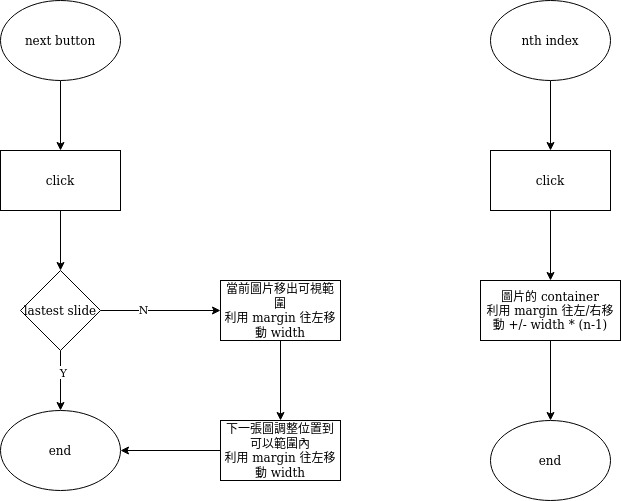

[Demo](https://qzcurious.github.io/simple-slider/)

# 我們做一個輪播圖 Slider

## Slider 的要有什麼元素

-   下一個的按鈕
-   上一個的按鈕
-   要被展示的圖片，可以多張
-   index 按鈕

## Slider 要有什麼功能

-   有多張被展示圖片的時候，可視範圍內只有一張圖片

-   index 按鈕用於直接跳到第 n 張圖
-   按下一個的按鈕要跳到下一張圖

## Slider 的樣式

-   可以條動大小
-   按鈕的樣式
-   index 的樣式
-   在換到另一張圖的時候，要有轉場效果

# Bug

- 按 next, prev 按鈕的時候 index 的 active 狀態沒有跟著改變。
  也就是說，用 next 按到第三張圖時，index 顯示的卻是第一個
